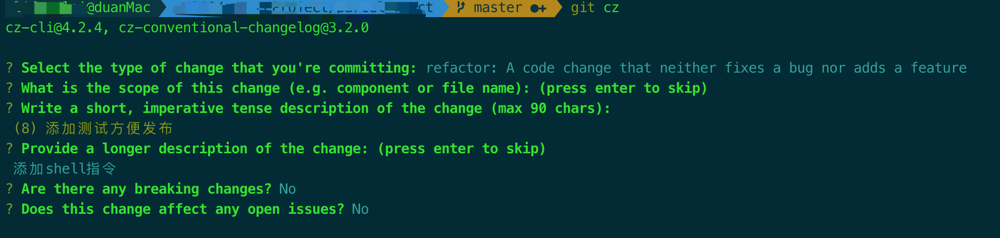
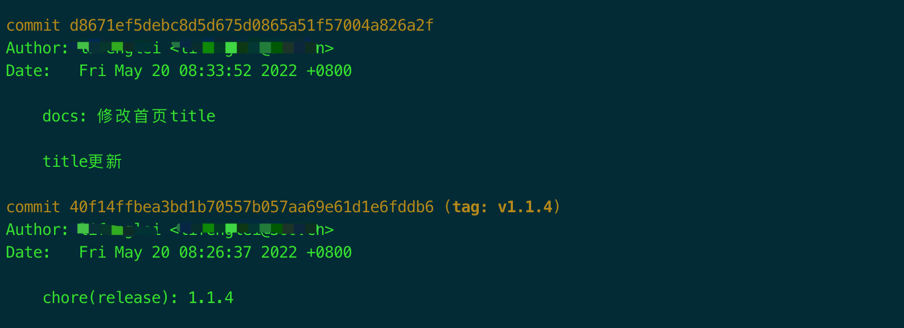
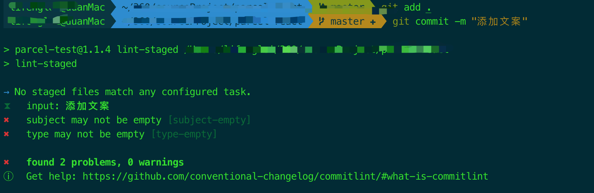
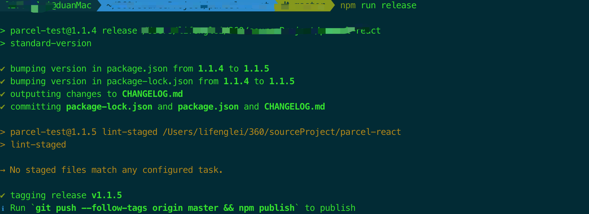
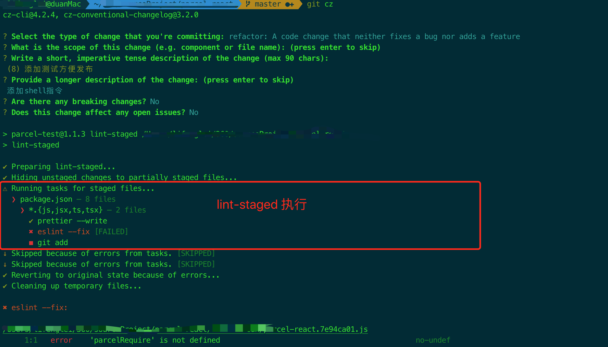
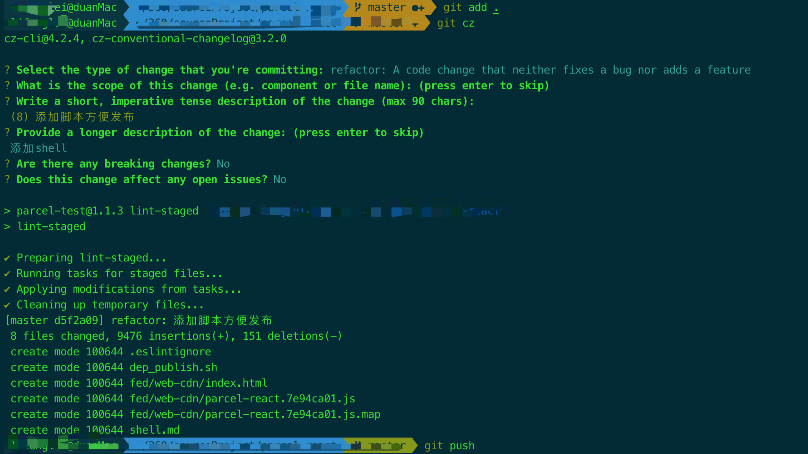
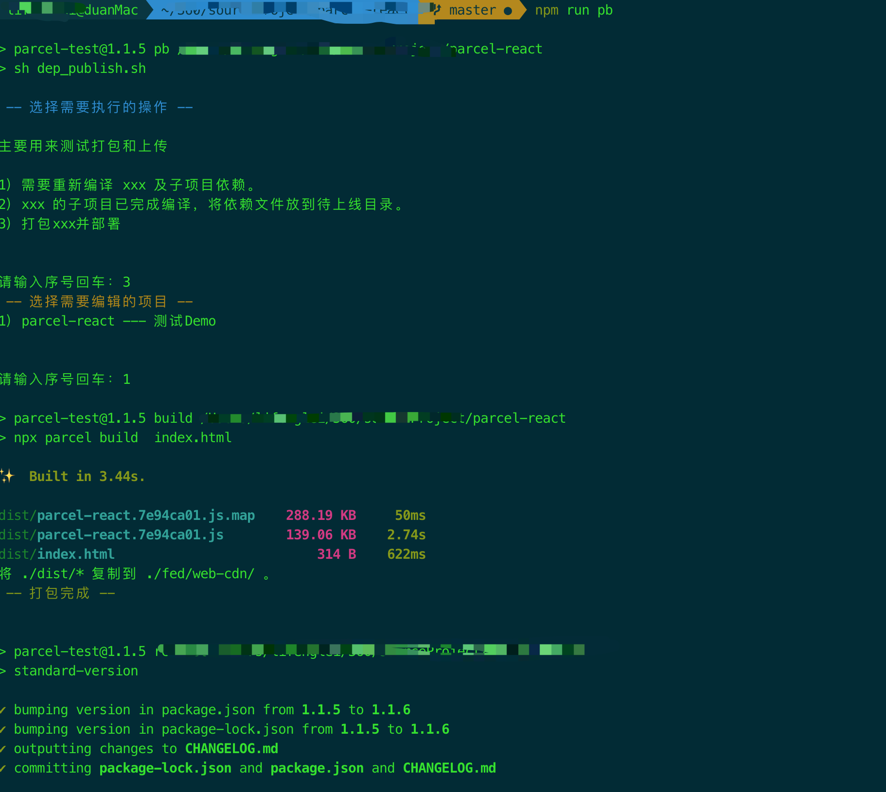

# parcel-react
主要是基于parcel创建的react项目用于快速开发

React 项目 parcel +commitizen + husky + commitlint+eslint，git commit 提交信息规范校验 demo，[conventional commits](https://www.conventionalcommits.org/en/v1.0.0/) 实践
- `parcel`：零配置 打包工具

- `commitizen`：使用 git cz 代替 git commit，规范开发的提交
- `husky + commitlint`：git commit 动作时，校验 commit 信息，如果不满足 commitizen 规范，无法提交
- `husky + eslint`：代码存在问题 没有解决 就无法提交 规范eslint
- `changeLog`:根据提交生成修改文档 方便查看修改内容 根据log生成
## commitizen 使用

[commitizen](https://github.com/commitizen/cz-cli) 是一个 cli 工具，用于规范化 git commit 信息，可以代替 git commit

```bash
npm install -g commitizen cz-conventional-changelog  # 安装规范化提交插件
echo '{"path": "cz-conventional-changelog"}' > ~/.czrc # 配置
git cz 
# ? Select the type of change that you're committing: docs:     Documentation only changes
# ? What is the scope of this change (e.g. component or file name): (press enter to skip) readme
# ? Write a short, imperative tense description of the change (max 86 chars):
# (46) update readme.md, add init project description
# ? Provide a longer description of the change: (press enter to skip) 
# ? Are there any breaking changes? No
# ? Does this change affect any open issues? No
# [main caae82e] docs(readme): update readme.md, add init project description
# 1 file changed, 7 insertions(+)
```


如图，git cz 运行后，会有如下 6 个步骤

### 1.选择提交类型(必填)

Select the type of change that you're committing: (Use arrow keys)

类型 | 描述
--- | ---
feat |     A new feature 
fix |    A bug fix 
docs |    Documentation only changes 
style |    Changes that do not affect the meaning of the code (white-space, formatting, missing semi-colons, etc) 
refactor | A code change that neither fixes a bug nor adds a feature 
perf |     A code change that improves performance 
test |    Adding missing tests or correcting existing tests 
build |    Changes that affect the build system or external dependencies (example scopes: gulp, broccoli, npm) 
ci |       Changes to our CI configuration files and scripts (example scopes: Travis, Circle, BrowserStack, SauceLabs) 
chore |    Other changes that don't modify src or test files 
revert |   Reverts a previous commit 

### 2.选择 scope 模块名(选填)
What is the scope of this change (e.g. component or file name): (press enter to skip) 

### 3.填写精炼的提交信息(必填)
Write a short, imperative tense description of the change (max 86 chars):

### 4.填写补充信息(选填)
Provide a longer description of the change: (press enter to skip) 

### 5.选择是否有破坏性更新(默认no)
Are there any breaking changes?

### 6.是否关联是 open 状态的 issue(默认no)
Does this change affect any open issues?

可以关闭 github issue，**但注意 commit 信息里面的末尾也要加 '(#issue编号)'**，这样在 github 体验更好
## docs 类型提交
```bash
# 修改 README.md
git add . # 添加到 git
git cz # 提交
# ? Select the type of change that you're committing: docs:     Documentation only changes
# ? What is the scope of this change (e.g. component or file name): (press enter to skip) readme
# ? Write a short, imperative tense description of the change (max 86 chars):
# (46) update readme.md, add init project description
# ? Provide a longer description of the change: (press enter to skip) 
# ? Are there any breaking changes? No
# ? Does this change affect any open issues? No
# [main caae82e] docs(readme): update readme.md, add init project description
# 1 file changed, 7 insertions(+)
# zuo@zmac comitizen-practice-demo % 
```
查看提交信息


## husky + commitlint 提交校验
[commitlint](https://github.com/conventional-changelog/commitlint) 结合 husky 可以在 git commit 时校验 commit 信息是否符合规范

### husk 安装
1. 安装 husky

```bash
npm install husky --save-dev
```

2. 安装 husky git hooks

```bash
# 方法1：
npx husky install
# 方法2：配置 package.json, scripts："prepare": "husky install"
npm run prepare
# husky - Git hooks installed
```
3. 测试 husky 钩子作用，添加 pre-commit 钩子
```bash
npx husky add .husky/pre-commit "npm test"
# 查看当前目录 .husky 目录是否有生成 pre-commit 文件
# 如果需要删除这个钩子，直接 删除 .husky/pre-commit 文件即可
```
### commitlint 安装配置
```bash
npm install -g @commitlint/cli @commitlint/config-conventional
# Configure commitlint to use conventional config
echo "module.exports = {extends: ['@commitlint/config-conventional']}" > commitlint.config.js
npx husky add .husky/commit-msg 'npx --no-install commitlint --edit "$1"'
```
测试
```bash
git add .
git commit -m 'xx'
这样的提交是不规范的 会提示如下图所示的信息
提示缺少 subject 就是提交信息、type 就是提交类型，按照规范提交就 ok 了
```

## 根据 commit 信息生成 changelog
### standard-version（自动生成、打tag） 
[standard-version](https://github.com/conventional-changelog/standard-version) 就很好的解决了这个问题。安装后，只需要 npm run release，就可以有 npm run version 的功能，而且提交信息是标准的 commitizen 规范，而且自动生成 changelog 自动打 tag，自动 commit。你只需要 push 即可。
```bash
npm install standard-version --save-dev
```
scripts 设置
```js
// scripts
"release": "standard-version"
```



需要注意的是：**CHANGELOG.md 是追加写入内容的，如果你之前没有对应的内容或删了之前的内容，会导致生成的内容较少，或者不完整。**

### release 特定版本
```bash
# 0.4.1
npm run release # 0.4.1 => 0.4.2
npm run release -- --prerelease # 0.4.2 to 0.4.3-0
npm run release # 0.4.3-0 to 0.4.3
npm run release -- --prerelease alpha # 0.4.3 to 0.4.4-alpha.0
# patch、minor、major
npm run release -- --release-as minor  # 0.4.4-alpha.0 to 0.5.0
npm run release -- --release-as patch # 0.5.0 to 0.5.1
npm run release -- --release-as major # 0.5.1 to 1.0.0
npm run release -- --release-as prepatch # 1.0.0 to 1.0.1-0
npm run release -- --release-as preminor # 1.0.1-0 to 1.1.0-0
npm run release -- --release-as premajor # 1.1.0-0 to 2.0.0-0
# 手动指定版本
npm run release -- --release-as 2.1.3-alpha.1 # 2.0.0-0 to 2.1.3-alpha.1
# ✔ bumping version in package.json from 2.0.0-0 to 2.1.3-alpha.1
# ✔ bumping version in package-lock.json from 2.0.0-0 to 2.1.3-alpha.1
# ✔ tagging release v2.1.3-alpha.1
npm run release # 2.1.3-alpha.1 to 2.2.0
```
对于版本号信息，参考 [npm version](https://docs.npmjs.com/cli/v7/commands/npm-version) 文档:

> The newversion argument should be a valid semver string, a valid second argument to [semver.inc](https://github.com/npm/node-semver#functions) (one of patch, minor, major, prepatch, preminor, premajor,
## Project setup(@vue/cli生成，请忽略)
```
npm install
```
### Compiles and hot-reloads for development
```
npm run start
```

### Compiles and minifies for production
```
npm run build
```


# 关于代码提交校验与打包部署

### 配置

```bash
{
  "name": "parcel-test",
  "version": "1.1.5",
  "description": "",
  "main": "index.js",
  "scripts": {
    "start": "npx parcel index.html",
    "build": "npx parcel build  index.html",
    "prepare": "husky install",
    "release": "standard-version",
    "lint-staged": "lint-staged",
    "pb": "sh dep_publish.sh"
  },
  "keywords": [],
  "author": "",
  "license": "ISC",
  "dependencies": {
    "prettier": "^2.6.2",
    "react": "^18.1.0",
    "react-dom": "^18.1.0"
  },
  "lint-staged": {
    "*.{js,jsx,ts,tsx}": [
      "prettier --write",
      "eslint --fix",
      "git add "
    ]
  }
}

当开发按照规范提交代码后 会触发husky中的`pre-commit`钩子  该钩子会去运行 `npm run lint-staged`

根据配置可知 lint-staged主要做了三件事

1.匹配文件
2.美化代码
3.eslint校验代码
4.添加暂存 git连续
```
### eslint 存在问题的提交



### 正常的提交 prefect



代码校验很重要 我们一定要慎重 ！！！
 ### eslint校验规范

 ```bash
 module.exports = {
  env: {
    browser: true,
    commonjs: true,
    es6: true,
  },
  extends: ['eslint:recommended', 'plugin:react/recommended'],
  parserOptions: {
    ecmaVersion: 8,
    parser: '@babel/eslint-parser',
    requireConfigFile: false,
    // 开启实验属性
    ecmaFeatures: {
      experimentalObjectRestSpread: true,
      // 修饰器
      experimentalDecorators: true,
      jsx: true,
    },
    sourceType: 'module',
  },
  plugins: ['react'],
  globals: {
    __DEV__: false,
    __dirname: false,
    window: true,
    define: true,
    history: true,
    location: true,
    wxjs: true,
    $: true,
    WeixinJSBridge: true,
    wx: true,
    process: true,
    qq: true,
  },
  settings: {
    react: {
      version: '16.2.0',
    },
  },

  /**
   * "off" 或 0 - 关闭规则
   * "warn" 或 1 - 开启规则，使用警告级别的错误：warn (不会导致程序退出),
   * "error" 或 2 - 开启规则，使用错误级别的错误：error (当被触发的时候，程序会退出)
   */
  rules: {
    'no-cond-assign': 2,
    'no-console': [
      'error',
      {
        allow: ['log', 'warn', 'error', 'info'],
      },
    ],
    // 禁止 function 定义中出现重名参数
    'no-dupe-args': 2,
    // 禁止对象字面量中出现重复的 key
    'no-dupe-keys': 2,
    // 禁止重复的 case 标签
    'no-duplicate-case': 2,
    // 禁止空语句块
    'no-empty': 2,
    // 禁止对 catch 子句的参数重新赋值
    'no-ex-assign': 2,
    // 禁止不必要的布尔转换
    'no-extra-boolean-cast': 2,
    // 禁止不必要的括号 //(a * b) + c;//报错
    'no-extra-parens': 0,

    // 强制所有控制语句使用一致的括号风格
    curly: [2, 'all'],
    // 禁止 catch 子句的参数与外层作用域中的变量同名
    'no-catch-shadow': 0,
    // 不允许标签与变量同名
    'no-label-var': 2,
    // 禁用特定的全局变量
    'no-restricted-globals': 2,
    // 禁止 var 声明 与外层作用域的变量同名
    'no-shadow': 0,
    // 禁止覆盖受限制的标识符
    'no-shadow-restricted-names': 2,
    // 禁止将变量初始化为 undefined
    'no-undef-init': 2,
    // 禁止将 undefined 作为标识符
    'no-undefined': 0,
    // 不允许在变量定义之前使用它们
    'no-use-before-define': 0,
    //
    // 风格指南 //
    //
    // 指定数组的元素之间要以空格隔开(, 后面)， never参数：[ 之前和 ] 之后不能带空格，always参数：[ 之前和 ] 之后必须带空格
    'array-bracket-spacing': [2, 'never'],
    // 禁止或强制在单行代码块中使用空格(禁用)
    'block-spacing': [1, 'never'],
    // 强制使用一致的缩进 第二个参数为 "tab" 时，会使用tab，
    // if while function 后面的{必须与if在同一行，java风格。
    'brace-style': [
      2,
      '1tbs',
      {
        allowSingleLine: true,
      },
    ],
    // 控制逗号前后的空格
    'comma-spacing': [
      2,
      {
        before: false,
        after: true,
      },
    ],
    // 控制逗号在行尾出现还是在行首出现 (默认行尾)
    // http://eslint.org/docs/rules/comma-style
    'comma-style': [2, 'last'],
    // "SwitchCase" (默认：0) 强制 switch 语句中的 case 子句的缩进水平
    // 以方括号取对象属性时，[ 后面和 ] 前面是否需要空格, 可选参数 never, always
    'computed-property-spacing': [2, 'never'],
    // 用于指统一在回调函数中指向this的变量名，箭头函数中的this已经可以指向外层调用者，应该没卵用了
    // e.g [0,"self"] 指定只能 var that = this. self不能指向其他任何值，this也不能赋值给self以外的其他值
    'consistent-this': [2, 'self', 'that', '_self', '_that', 'me', '_this'],
    // 强制使用命名的 function 表达式
    'func-names': 0,
    // 文件末尾强制换行
    'eol-last': 2,
    indent: ['error', 2],
    // 要求或禁止在函数标识符和其调用之间有空格
    'func-call-spacing': 2,
    // 强制在对象字面量的属性中键和值之间使用一致的间距
    'key-spacing': [
      2,
      {
        beforeColon: false,
        afterColon: true,
      },
    ],
    // 要求在注释周围有空行 ( 要求在块级注释之前有一空行)
    'lines-around-comment': [
      2,
      {
        beforeBlockComment: true,
      },
    ],
    'func-style': 0,
    // 强制回调函数最大嵌套深度 5层
    'max-nested-callbacks': [2, 5],
    // 禁止使用指定的标识符
    'id-blacklist': 0,
    // 强制标识符的最新和最大长度
    'id-length': 0,
    // 要求标识符匹配一个指定的正则表达式
    'id-match': 0,
    // 强制在 JSX 属性中一致地使用双引号或单引号
    'jsx-quotes': 0,
    // 强制在关键字前后使用一致的空格 (前后腰需要)
    'keyword-spacing': 2,
    // 强制一行的最大长度
    'max-len': [2, 200, { ignoreUrls: true }],
    // 强制最大行数
    'max-lines': 0,
    // 强制 function 定义中最多允许的参数数量
    'max-params': [1, 5],
    // 强制 function 块最多允许的的语句数量
    'max-statements': [1, 200],
    // 强制每一行中所允许的最大语句数量
    'max-statements-per-line': 0,
    // 要求构造函数首字母大写 （要求调用 new 操作符时有首字母大小的函数，允许调用首字母大写的函数时没有 new 操作符。）
    'new-cap': [
      2,
      {
        newIsCap: true,
        capIsNew: false,
      },
    ],
    // 要求调用无参构造函数时有圆括号
    'new-parens': 2,
    // 要求或禁止 var 声明语句后有一行空行
    'newline-after-var': 0,
    // 禁止使用 Array 构造函数
    'no-array-constructor': 2,
    // 禁用按位运算符
    'no-bitwise': 0,
    // 要求 return 语句之前有一空行
    'newline-before-return': 0,
    // 要求方法链中每个调用都有一个换行符
    'newline-per-chained-call': 1,
    // 禁用 continue 语句
    'no-continue': 0,
    // 禁止在代码行后使用内联注释
    'no-inline-comments': 0,
    // 禁止 if 作为唯一的语句出现在 else 语句中
    'no-lonely-if': 0,
    // 禁止混合使用不同的操作符
    'no-mixed-operators': 0,
    // 禁止空格和 tab 的混合缩进
    'no-mixed-spaces-and-tabs': ['error', 'smart-tabs'],
    // 不允许多个空行
    'no-multiple-empty-lines': [
      2,
      {
        max: 2,
      },
    ],
    // 不允许否定的表达式
    'no-negated-condition': 0,
    // 不允许使用嵌套的三元表达式
    'no-nested-ternary': 0,
    // 禁止使用 Object 的构造函数
    'no-new-object': 2,
    // 禁止使用一元操作符 ++ 和 --
    'no-plusplus': 0,
    // 禁止使用特定的语法
    'no-restricted-syntax': 0,
    // 禁止 function 标识符和括号之间出现空格
    'no-spaced-func': 2,
    // 不允许使用三元操作符
    'no-ternary': 0,
    // 禁用行尾空格
    'no-trailing-spaces': 2,
    // 禁止标识符中有悬空下划线_bar
    'no-underscore-dangle': 0,
    // 禁止可以在有更简单的可替代的表达式时使用三元操作符
    'no-unneeded-ternary': 2,
    // 禁止属性前有空白
    'no-whitespace-before-property': 2,
    // 要求或禁止在 var 声明周围换行
    'one-var-declaration-per-line': 0,
    // 要求或禁止在可能的情况下要求使用简化的赋值操作符
    'operator-assignment': 0,
    // 强制操作符使用一致的换行符
    'operator-linebreak': [
      2,
      'after',
      {
        overrides: {
          '?': 'before',
          ':': 'before',
        },
      },
    ],
    // 要求或禁止块内填充
    'padded-blocks': 0,
    // 要求对象字面量属性名称用引号括起来
    'quote-props': 0,
    // 强制使用一致的反勾号、双引号或单引号
    quotes: [2, 'single', 'avoid-escape'],
    // 要求使用 JSDoc 注释
    'require-jsdoc': 0,
    // 要求或禁止使用分号而不是 ASI（这个才是控制行尾部分号的，）
    semi: [2, 'always'],
    // 强制分号之前和之后使用一致的空格
    'semi-spacing': 2,
    // 要求同一个声明块中的变量按顺序排列
    'sort-vars': 0,
    // 强制在块之前使用一致的空格
    'space-before-blocks': [2, 'always'],
    // 强制在 function的左括号之前使用一致的空格
    'space-before-function-paren': [2, 'always'],
    // 强制在圆括号内使用一致的空格
    'space-in-parens': [2, 'never'],
    // 要求操作符周围有空格
    'space-infix-ops': 2,
    // 强制在一元操作符前后使用一致的空格
    'space-unary-ops': [
      2,
      {
        words: true,
        nonwords: false,
      },
    ],
    // 强制在注释中 // 或 /* 使用一致的空格
    'spaced-comment': [
      2,
      'always',
      {
        markers: [
          'global',
          'globals',
          'eslint',
          'eslint-disable',
          '*package',
          '!',
        ],
      },
    ],
    // 要求或禁止 Unicode BOM
    'unicode-bom': 2,
    // 要求正则表达式被括号括起来
    'wrap-regex': 0,
    // 禁止词法声明 (let、const、function 和 class) 出现在 case或default 子句中
    'no-case-declarations': ['warn'],
    //
    // ES6.相关 //
    //
    // 要求箭头函数体使用大括号
    'arrow-body-style': 2,
    // 要求箭头函数的参数使用圆括号
    'arrow-parens': 2,
    'arrow-spacing': [
      2,
      {
        before: true,
        after: true,
      },
    ],
    // 强制 generator 函数中 * 号周围使用一致的空格
    'generator-star-spacing': [
      2,
      {
        before: true,
        after: true,
      },
    ],
    // 禁止修改类声明的变量
    'no-class-assign': 2,
    // 不允许箭头功能，在那里他们可以混淆的比较
    'no-confusing-arrow': 0,
    // 禁止修改 const 声明的变量
    'no-const-assign': 2,
    // 禁止类成员中出现重复的名称
    'no-dupe-class-members': 2,
    // 每个模块只能使用一个import
    'no-duplicate-imports': 2,
    // 禁止 Symbolnew 操作符和 new 一起使用
    'no-new-symbol': 2,
    // 允许指定模块加载时的进口
    'no-restricted-imports': 0,
    // 禁止在构造函数中，在调用 super() 之前使用 this 或 super
    'no-this-before-super': 2,
    // 禁止不必要的计算性能键对象的文字
    'no-useless-computed-key': 0,
    // 要求使用 let 或 const 而不是 var
    'no-var': 1,
    // 要求或禁止对象字面量中方法和属性使用简写语法
    'object-shorthand': 0,
    // 要求使用箭头函数作为回调
    'prefer-arrow-callback': 0,
    // 要求使用 const 声明那些声明后不再被修改的变量
    'prefer-const': 0,
    // 要求在合适的地方使用 Reflect 方法
    'prefer-reflect': 0,
    // 要求使用扩展运算符而非 .apply()
    'prefer-spread': 0,
    // 要求使用模板字面量而非字符串连接
    'prefer-template': 0,
    // Suggest using the rest parameters instead of arguments
    'prefer-rest-params': 0,
    // 要求generator 函数内有 yield
    'require-yield': 2,
    // 要求或禁止模板字符串中的嵌入表达式周围空格的使用
    'template-curly-spacing': 1,
    // 强制在 yield* 表达式中 * 周围使用空格
    'yield-star-spacing': 2,
    // 强制使用一致的换行风格
    'linebreak-style': [2, 'unix'],
    // 在JSX中强制布尔属性符号
    'react/jsx-boolean-value': 2,
    // 在JSX中验证右括号位置
    // "react/jsx-closing-bracket-location": 1,
    // 在JSX属性和表达式中加强或禁止大括号内的空格。
    'react/jsx-curly-spacing': [
      2,
      {
        when: 'never',
        children: true,
      },
    ],
    // 在数组或迭代器中验证JSX具有key属性
    'react/jsx-key': 2,
    // 限制JSX中单行上的props的最大数量
    'react/jsx-max-props-per-line': [
      1,
      {
        maximum: 5,
      },
    ],
    // 防止在JSX中重复的props
    'react/jsx-no-duplicate-props': 2,
    //  //防止使用未包装的JSX字符串
    // "react/jsx-no-literals": 0,
    // 在JSX中禁止未声明的变量
    'react/jsx-no-undef': 2,
    // 为用户定义的JSX组件强制使用PascalCase
    'react/jsx-pascal-case': 0,
    // 防止反应被错误地标记为未使用
    'react/jsx-uses-react': 2,
    // 防止在JSX中使用的变量被错误地标记为未使用
    'react/jsx-uses-vars': 2,
    // 防止在componentDidMount中使用setState
    'react/no-did-mount-set-state': 2,
    // 防止在componentDidUpdate中使用setState
    'react/no-did-update-set-state': 2,
    // 防止使用未知的DOM属性
    'react/no-unknown-property': 2,
    // 为React组件强制执行ES5或ES6类
    'react/prefer-es6-class': 2,
    // 防止在React组件定义中丢失props验证
    // "react/prop-types": 1,
    // 使用JSX时防止丢失React
    'react/react-in-jsx-scope': 2,
    // 防止没有children的组件的额外结束标签
    'react/self-closing-comp': 0,
    // 禁止不必要的bool转换
    // "no-extra-boolean-cast": 0,
    // 防止在数组中遍历中使用数组key做索引
    // "react/no-array-index-key": 0,
    // 不使用弃用的方法
    'react/no-deprecated': 2,
    // 在JSX属性中强制或禁止等号周围的空格
    'react/jsx-equals-spacing': 2,
    'react/jsx-filename-extension': [
      2,
      {
        extensions: ['.js', '.jsx'],
      },
    ],
    // 禁止未使用的变量
    'no-unused-vars': 0,
  },
};

 ```

 # 关于部署

 ### 前端发展过程中 我们逐渐的感受到`规范化` `组件化` `模块化` `工程化` `自动化 `带来的红利
在项目开发过程中我们可以通过过shell的学习 来编写脚本来帮我们打包和部署
####  项目中运行
    npm run pb
会看如下图示



说明：

shell脚本将项目的打包构建与生成changeLog 以及完成tag的push
一气呵成 其实我们还可以通过ssh连接服务器 然后将带包后的代码直接推送到服务端 完成部署 几行代码的事情

关于shell指令学习 我放到了项目的shell.md 需要的小伙伴可以去学习下
